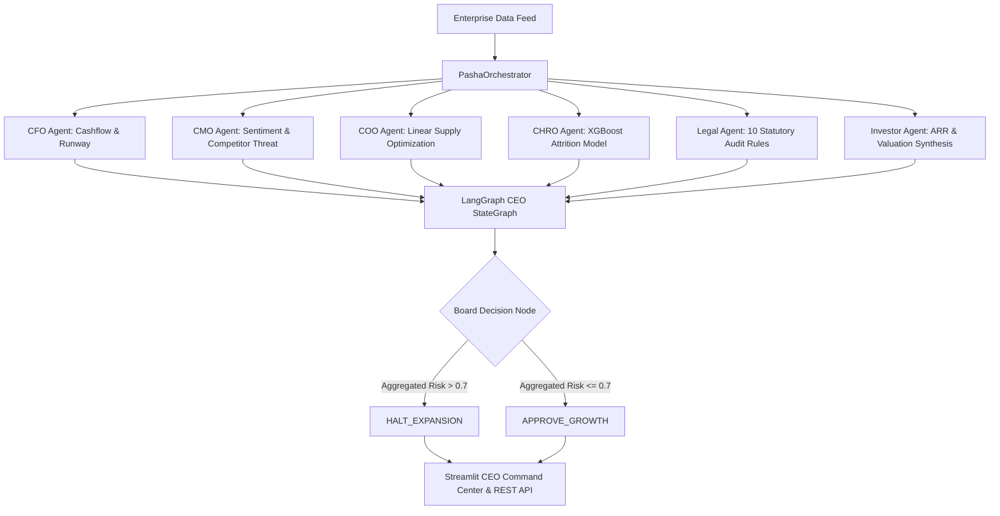

# PASHA-OS: Predictive Autonomous System for Holistic Administration

[](https://www.python.org/)
[](https://fastapi.tiangolo.com/)
[](https://github.com/langchain-ai/langgraph)
[](https://streamlit.io/)
[](https://www.docker.com/)
[](https://opensource.org/licenses/MIT)

**PASHA-OS** (Predictive Autonomous System for Holistic Administration) is an enterprise-grade Autonomous CEO Enterprise Intelligence OS designed to assist C-Suite executives with real-time risk assessment, financial runway forecasting, legal contract audit, supply chain optimization, employee turnover prediction, and corporate strategy decision-making.

---

## 🏗️ Multi-Agent Architecture & Flow



---

## 🤖 C-Suite Autonomous Agents

| Agent | Class | Core Responsibility | Technique / Library |
|---|---|---|---|
| **CFO Agent** | `CFOAgent` | Cashflow forecasting, liquidity runway, financial risk assessment | NumPy, Linear Trend Analysis |
| **CMO Agent** | `CMOAgent` | Market sentiment scoring, competitor intelligence threat matrix | NLP Lexicon Analysis |
| **COO Agent** | `COOAgent` | Global supply chain distribution & cost minimization | PuLP Linear Programming |
| **CHRO Agent**| `CHROAgent`| Workforce turnover and high-risk attrition prediction | XGBoost Machine Learning |
| **Legal Agent**| `LegalAgent`| Regulatory statutory rule auditing and contract risk assessment | Statutory Rule Engine (10 Rules) |
| **Investor Agent**| `InvestorAgent`| Investor relations, ARR tracking, valuation multiple synthesis | Enterprise Financial Modeling |
| **Strategy CEO Agent**| `ceo_app` | Executive decision synthesis (HALT_EXPANSION / APPROVE_GROWTH) | LangGraph StateGraph |

---

## 🛠️ Tech Stack

* **Core AI & Workflow Orchestration**: LangGraph (0.2.39), LangChain (0.3.7), FAISS (1.8.0), ChromaDB (0.5.18)
* **API & Real-time WebSockets**: FastAPI (0.115.0), Uvicorn, WebSockets, Prometheus Client
* **Dashboard & Visualizations**: Streamlit (1.39.0), Plotly (5.24.1), FPDF2, python-pptx
* **Analytics & Optimization**: Prophet, XGBoost, scikit-learn, PuLP, NumPy
* **Testing & Quality Assurance**: Pytest (8.3.2), Flake8 (7.1.0)

---

## 🚀 Quick Start

### 1. Local Setup
```bash
git clone https://github.com/your-org/PASHA-OS.git
cd PASHA-OS
pip install -r requirements.txt
```

### 2. Run FastAPI Web Service
```bash
uvicorn api.main:app --host 0.0.0.0 --port 8000
```
* Interactive Swagger Docs: `http://localhost:8000/docs`
* Prometheus Telemetry: `http://localhost:8000/metrics`

### 3. Launch Streamlit Executive Command Center
```bash
streamlit run dashboard/app.py
```
* Access Dashboard: `http://localhost:8501`

---

## 🐳 Docker Deployment

Run all services (FastAPI, Streamlit Dashboard, Prometheus) with Docker Compose:

```bash
docker-compose up --build
```

---

## 🧪 Testing & Code Quality

Run full unit and integration test suite:
```bash
python3 -m pytest tests/ -v
```

Run PEP8 compliance check:
```bash
flake8 . --max-line-length=120
```

---

## 📄 License
Distributed under the MIT License.
