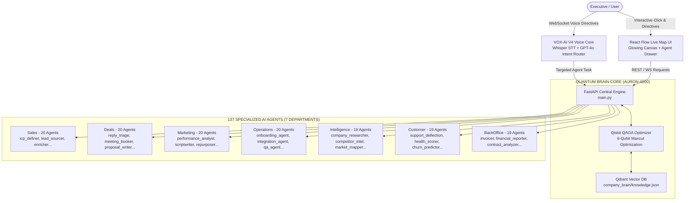

# AURON-CORP-137Q | Quantum-Enhanced Enterprise Operating System 🚀⚛️

[](https://python.org)
[](https://fastapi.tiangolo.com)
[](https://qiskit.org)
[](#vox-ai-v4-voice-architecture)
[](https://react.dev)
[](#deployment)

> **Architect:** Mohammad Subhan Pasha
> **Ecosystem Integration:** AURON-4000™ | VOX-AI V4 | PASHA-OS
> **Live Demo Concept:** Live Interactive Company OS with **137 AI Agents across 7 Departments**, orchestrated by a **Qiskit QAOA Quantum Core** and **VOX-AI V4 Streaming Voice Control**.

---

## 🌟 Architecture Overview

AURON-CORP-137Q is an enterprise-grade autonomous MNC operating platform. At its core, a **Qiskit-based Quantum Approximate Optimization Algorithm (QAOA)** balances workloads and routes tasks dynamically across 137 AI agents. Users interact with the company via real-time WebSocket voice directives powered by the **VOX-AI V4** pipeline or through a futuristic dark-mode live map UI built with React Flow.



---

## ⚡ Department & Agent Taxonomy (137 Agents)

The company comprises **137 specialized AI agents** categorized into 7 operational departments:

1. **Sales (20 Agents):** `icp_definer`, `lead_sourcer`, `enricher`, `cold_email_writer`, `sequencer`, `call_prep_agent`, `intent_signal_tracker`, `linkedin_prospector`, `objection_handler`, `domain_warmup_agent`, `lead_scorer`, `competitor_battle_card`, `referral_finder`, `cadence_optimizer`, `chp_verifier`, `event_lead_capturer`, `account_mapper`, `territory_planner`, `sales_enablement`, `sales_analyst`.
2. **Deals (20 Agents):** `reply_triage`, `meeting_booker`, `proposal_writer`, `debrief_analyst`, `deal_health_monitor`, `pricing_calculator`, `contract_redliner`, `stakeholder_alignment`, `discount_approver`, `crm_sync_agent`, `demo_customizer`, `value_engineer`, `procurement_navigator`, `term_sheet_gen`, `closing_agent`, `loss_analyzer`, `partner_co_seller`, `expansion_spotter`, `deal_desk_orchestrator`, `commission_tracker`.
3. **Marketing (20 Agents):** `performance_analyst`, `scriptwriter`, `carousel_designer`, `repurposer`, `seo_auditor`, `copywriter`, `brand_voice_guard`, `newsletter_editor`, `landing_page_gen`, `social_scheduler`, `influencer_matcher`, `community_manager`, `event_promoter`, `pr_outreach_agent`, `attribution_engine`, `lead_magnet_creator`, `abm_orchestrator`, `competitor_ad_spy`, `viral_hook_generator`, `cro_experimenter`.
4. **Operations (20 Agents):** `onboarding_agent`, `integration_agent`, `qa_agent`, `workflow_automator`, `tool_cost_optimizer`, `vendor_manager`, `incident_responder`, `access_controller`, `data_hygiene_agent`, `process_documentation`, `resource_allocator`, `sla_tracker`, `equipment_provisioner`, `compliance_auditor`, `knowledge_base_agent`, `change_management`, `backup_disaster_recovery`, `supply_chain_tracker`, `meeting_summarizer`, `cross_dept_bridge`.
5. **Intelligence (19 Agents):** `company_researcher`, `competitor_intel`, `market_mapper`, `trend_forecaster`, `tech_stack_analyzer`, `funding_tracker`, `patent_monitor`, `sentiment_analyzer`, `regulatory_watcher`, `talent_movement_tracker`, `pricing_intelligence`, `news_curator`, `crypto_web3_analyst`, `geopolitical_risk`, `academic_researcher`, `m_and_a_scout`, `customer_voice_miner`, `dark_web_monitor`, `esg_tracker`.
6. **Customer (19 Agents):** `support_deflection`, `health_scorer`, `churn_predictor`, `expansion_manager`, `nps_analyzer`, `renewal_specialist`, `customer_advocate`, `escalation_router`, `ticket_tagger`, `feature_request_sync`, `community_moderator`, `training_coach`, `vip_white_glove`, `billing_support`, `refund_approver`, `welcome_drip_agent`, `kb_article_writer`, `portal_manager`, `customer_surveyor`.
7. **BackOffice (19 Agents):** `invoicer`, `financial_reporter`, `contract_analyzer`, `expense_auditor`, `payroll_processor`, `tax_compliance_agent`, `accounts_payable`, `accounts_receivable`, `cap_table_manager`, `recruiter_screener`, `employee_onboarding`, `benefits_administrator`, `corporate_governance`, `audit_trail_agent`, `bank_reconcilation`, `procurement_buyer`, `facilities_manager`, `travel_concierge`, `dei_analytics_agent`.

---

## ⚛️ Quantum Optimization Layer (AURON-4000)

Located at `/brain/quantum_brain.py`, the Quantum Brain uses **Qiskit Aer Statevector Sampler** and **COBYLA optimization** to solve a **Maxcut QAOA graph formulation** over 6 qubits.
- **Objective:** Dynamically partition agent workloads between primary execution clusters to minimize operational latency and prevent bottlenecks.
- **Qdrant Vector Memory Integration:** Persists enterprise context and knowledge points for hybrid RAG agent reasoning.

---

## 🎙️ VOX-AI V4 Voice Architecture

Located at `/main.py` under the `/ws/voice` WebSocket endpoint:
1. **Streaming Speech Intake:** Captures real-time Web Speech API audio transcripts.
2. **GPT-4o Intent Router:** Classifies user directives (e.g., *"Sales team, find 10 leads in Hamburg"*) and maps them to target agent capabilities.
3. **Agent Dispatch & Neural TTS:** Triggers agent reasoning and returns real-time spoken responses.

---

## 🛠️ Quickstart & Local Running

### Prerequisites
- Python 3.12+
- Node.js 22+

### 1. Install & Run Backend
```bash
pip install -r requirements.txt
uvicorn main:app --host 0.0.0.0 --port 8000
```

### 2. Frontend Development / Build
```bash
cd frontend
npm install
npm run build
```

---

## 🐳 Docker & Kubernetes Deployment

### Docker Compose
```bash
docker-compose up --build -d
```

### Kubernetes Deployment
```bash
kubectl apply -f k8s/deployment.yaml
```

---

## 🎥 Loom Demo Presentation Script

> **Title:** Introducing AURON-CORP-137Q: The World's First Quantum-Enhanced 137-Agent Company OS
> **Speaker:** Mohammad Subhan Pasha

### Script (3-Minute Presentation)
1. **[0:00 - 0:30] Introduction & Problem:**
   *"Hi everyone, I'm Mohammad Subhan Pasha. Today I'm thrilled to present AURON-CORP-137Q — a production-ready, quantum-enhanced Autonomous Operating System for enterprise companies."*

2. **[0:30 - 1:15] Live Map & 137 Agents Showcase:**
   *"As you can see on this glowing interactive map, AURON-CORP-137Q coordinates 137 specialized AI agents spread across 7 key departments: Sales, Deals, Marketing, Operations, Intelligence, Customer, and BackOffice. Clicking on any node opens an agent drawer where you can inspect skills, operational mode, and run tasks live."*

3. **[1:15 - 2:00] Quantum Brain (Qiskit QAOA):**
   *"At the center sits our Quantum Core — AURON-4000. By clicking 'QAOA Optimize', our backend executes real 6-qubit Qiskit QAOA circuits to optimize agent load distribution and eliminate task bottlenecks across department clusters."*

4. **[2:00 - 2:45] VOX-AI V4 Voice Control:**
   *"Now watch this — using my VOX-AI V4 streaming voice stack, I can click 'Talk to Company' and issue a voice directive: 'Sales team, find 10 leads in Hamburg'. The system automatically parses intent, routes to lead_sourcer, and responds back in real time."*

5. **[2:45 - 3:00] Closing & Enterprise Readiness:**
   *"Built with FastAPI, React Flow, Qiskit, Qdrant, Docker, and Kubernetes manifests. AURON-CORP-137Q is ready for enterprise production deployment. Thank you!"*
