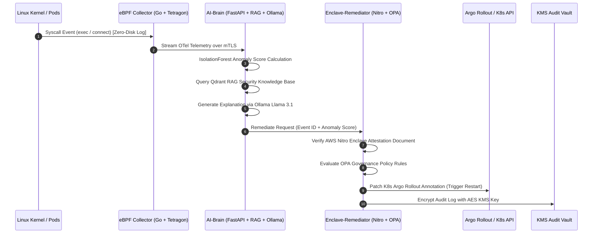

<p align="center">
  
</p>

<h1 align="center">PASHA-X: Zero-Trust AI Governance Plane</h1>
<p align="center"><strong>A Confidential AIOps Platform for Enterprise Kubernetes Clusters</strong><br>Zero-Footprint eBPF Probes · IsolationForest + RAG AI-Brain · AWS Nitro Enclave Attestation · Argo Rollouts</p>

---

## 🌟 Executive Overview
**PASHA-X** is an enterprise-grade, zero-footprint, AI-enabled DevSecOps governance plane designed for high-security Kubernetes environments. Unlike legacy security solutions that rely on disk-heavy sidecar file logs or vulnerable daemon agents, PASHA-X captures system calls directly in the Linux kernel using **eBPF (Cilium Tetragon)**, stream-evaluates threats in memory using **IsolationForest ML** and **Qdrant RAG + Ollama Llama 3.1**, and executes cryptographically verified remediation within an **AWS Nitro Enclave**.

---

## 🏗️ Architecture & Zero-Trust Sequence Flow



---

## 🛡️ Why No Footprint = High Security

1. **Zero Attack Surface on Host Disk:** Traditional logging solutions write plaintext security logs to host disk paths like `/var/log/containers/`. Adversaries with container escape or root privilege can modify, wipe, or tamper with host log files to clear their tracks. PASHA-X streams eBPF kernel events directly via RAM (`/dev/shm`) over mTLS, leaving **0 bytes** on the host file system.
2. **Confidential Container Execution (Kata Containers):** Microservices execute inside hardware-isolated Kata Confidential Containers, preventing host root processes from inspecting container memory state.
3. **Hardware Enclave Attestation:** Decisions are verified in an isolated AWS Nitro Enclave, guaranteeing code integrity via cryptographic PCR0/PCR1/PCR2 measurements before any Kubernetes mutation is permitted.
4. **Immutable Cryptographic Auditability:** Every governance action is logged and encrypted with KMS AES keys, producing SHA-256 integrity hashes for compliance.

---

## 📁 Repository Structure

```
.
├── src/
│   ├── ebpf-collector/          # Go + eBPF Cilium Tetragon collector (Zero-Disk OTel transport)
│   ├── ai-brain/                # Python FastAPI + IsolationForest + Qdrant RAG + Ollama Llama 3.1
│   ├── enclave-remediator/      # Python AWS Nitro Enclave attestation + OPA policy + KMS logger
│   └── signer/                  # Syft SPDX SBOM generator & Cosign Keyless Image Signer
├── k8s/
│   ├── tetragon-policy.yaml     # Tetragon TracingPolicy for sys_execve and sys_connect
│   ├── kyverno-policies/        # Kyverno policies (deny-privileged, require-signed-images)
│   ├── argo-rollout.yaml        # Argo Rollout canary deployment manifest
│   └── confidential-deployment.yaml # Kata Containers runtimeClass deployment
├── .github/workflows/
│   └── slsa-secure-pipeline.yaml # Multi-stage non-root build, Syft, Trivy, Cosign SLSA pipeline
├── scripts/
│   └── zero-footprint-install.sh # Zero-footprint installer running entirely in /dev/shm
└── README.md
```

---

## 🚀 Quick Start & Live Demonstration

### 1. Execute Zero-Footprint Installation & Demo
Run the installation script in shared memory:

```bash
chmod +x scripts/zero-footprint-install.sh
./scripts/zero-footprint-install.sh
```

### 2. Run Test Suites
Validate all Go and Python microservices:

```bash
# Test eBPF Collector (Go)
(cd src/ebpf-collector && go test -v ./...)

# Test AI-Brain (Python)
PYTHONPATH=src/ai-brain python3 -m pytest src/ai-brain/tests/ -v

# Test Enclave Remediator (Python)
PYTHONPATH=src/enclave-remediator python3 -m pytest src/enclave-remediator/tests/ -v
```

### 3. Generate SBOM and Cosign Signature
```bash
chmod +x src/signer/generate_sbom_and_sign.sh
./src/signer/generate_sbom_and_sign.sh pasha-x/ai-brain:latest /tmp/sbom-outputs
```

---

## 📊 Microservices Prometheus Metrics Standard
All microservices expose `/metrics` endpoints:
- `ebpf-collector`: Port `8080/metrics` (`ebpf_events_collected_total`, `ebpf_events_exported_total`)
- `ai-brain`: Port `8000/metrics` (`ai_brain_ingested_events_total`, `ai_brain_anomalies_detected_total`)
- `enclave-remediator`: Port `8001/metrics` (`remediator_actions_total`, `remediator_opa_verifications_total`)

---

## 👥 Built By
**Mohammad Subhan Pasha** - Enterprise AI & DevSecOps Platform Engineer.
