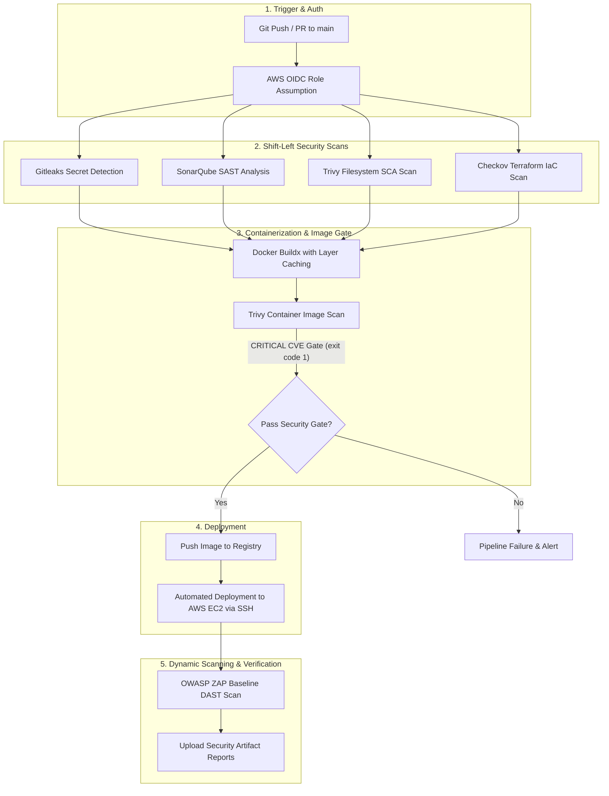

  

<h1 align="center">PASHA-OS</h1>

<strong>Autonomous C-Suite AI Operating System</strong> 7 Agents. 1 Objective. Zero Downtime.

## 🚀 What is PASHA-OS?
CEO, CFO, CTO, CMO, COO, CHRO, Legal - 7 AI Agents

---

## 🔒 Production-Grade DevSecOps Pipeline

PASHA-OS incorporates an end-to-end production-grade **DevSecOps Lifecycle Pipeline** configured in `.github/workflows/devsecops.yml`. Security scanning, compliance checks, and automated deployments are integrated at every stage of the software delivery lifecycle.

### 🏗️ DevSecOps Architecture Lifecycle

---

### 🛡️ DevSecOps Pipeline Components

1. **Secret Scanning (Gitleaks)**: Scans source code and git history for accidentally committed API keys, AWS credentials, or secrets.
2. **Static Application Security Testing (SonarQube SAST)**: Analyzes source code for security vulnerabilities, code smells, and quality bugs.
3. **Software Composition Analysis (Trivy FS)**: Scans Python packages, dependencies, and OS libraries for known CVE vulnerabilities.
4. **Infrastructure as Code Scan (Checkov)**: Scans Terraform AWS infrastructure manifests in `terraform/` for misconfigurations and security best practice compliance.
5. **Docker Build with Layer Caching**: Multi-stage Docker build utilizing GitHub Actions cache (`type=gha`) for fast, efficient image builds.
6. **Container Vulnerability Gate (Trivy Image Scan)**: Scans built Docker image; fails the pipeline (`exit-code 1`) if any `CRITICAL` severity CVE is detected.
7. **AWS OIDC Authentication**: Passwordless, credential-less authentication using OpenID Connect (`aws-actions/configure-aws-credentials`) to assume AWS IAM roles securely.
8. **Automated EC2 Deployment via SSH**: Automated SSH deployment (`appleboy/ssh-action`) that pulls the verified container image and restarts the application instance on AWS EC2.
9. **Dynamic Application Security Testing (OWASP ZAP)**: Executes an automated DAST baseline vulnerability scan against the running EC2 HTTP endpoint.
10. **Security Artifact Reports**: Uploads SARIF and HTML scan reports (Gitleaks, SonarQube, Trivy, Checkov, OWASP ZAP) directly to GitHub Actions artifacts for compliance auditing.

---

### 🔑 Required GitHub Secrets

To run the DevSecOps workflow, configure the following secrets in your GitHub Repository settings (`Settings > Secrets and variables > Actions`):

| Secret Name | Description |
|---|---|
| `AWS_ROLE_ARN` | IAM Role ARN for GitHub Actions AWS OIDC authentication |
| `DOCKERHUB_USERNAME` | Docker Hub username for container registry push/pull |
| `DOCKERHUB_TOKEN` | Docker Hub access token or password |
| `EC2_HOST` | Host IP address or domain of target AWS EC2 deployment instance |
| `EC2_USERNAME` | SSH login user for EC2 instance (default: `ec2-user`) |
| `EC2_SSH_KEY` | Private SSH key for EC2 instance access |
| `SONAR_TOKEN` | (Optional) SonarQube / SonarCloud authentication token |
| `SONAR_PROJECT_KEY` | (Optional) SonarQube project key |
| `SONAR_ORGANIZATION` | (Optional) SonarQube organization key |

---

## 📊 Monitoring (NEW from PR #11)
- **Metrics:** `/metrics` endpoint with prometheus-fastapi-instrumentator
- **K8s:** `monitoring` namespace, ServiceMonitor, PodMonitor
- **Grafana:** Golden Signals Dashboard
- **Alerts:** HTTP 5xx, latency, crash loops
- **Deploy:** `scripts/deploy-monitoring.sh`

## 🛠️ Tech Stack
Python | LangGraph | FastAPI | Streamlit | Docker | Terraform | AWS | Prometheus | Grafana | Gitleaks | Trivy | Checkov | OWASP ZAP

## 📸 Demo

Built by @mdsubhanpasha
