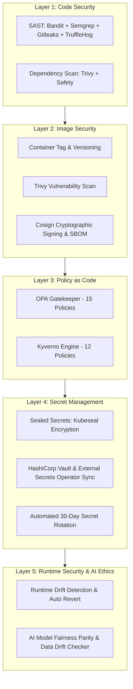

<p align="center">
  
</p>

<h1 align="center">NAYEEM-FLOW-OS: Modern Engineering Workflow & Zero-Trust Platform</h1>
<p align="center"><strong>5-Layer Enterprise Security • Autonomous AI Swarm Governance • Kubernetes Microservices</strong><br>Zero-Trust Security. Policy as Code. Vault ESO. 0 Vulnerabilities.</p>

---

## 🔒 5-Layer Enterprise Security Architecture

NAYEEM-FLOW-OS integrates a Zero-Trust 5-Layer Security Engine guarding every stage of the software lifecycle:



---

## 📋 Security & Compliance Matrix

| Compliance Standard | Security Layer | Status | Audited Mechanism |
|---|---|---|---|
| **SOC 2 Type II** | Layer 1, Layer 4 | ✅ COMPLIANT | Automated SAST, Secrets Scanning, Vault AES-256 Secret Storage |
| **GDPR** | Layer 3, Layer 5 | ✅ COMPLIANT | OPA/Kyverno Data Isolation, Model Algorithmic Bias & Data Quality Parity |
| **ISO 27001** | Layer 2, Layer 4 | ✅ COMPLIANT | Cosign Image Attestation, SPDX SBOM, 30-Day Automated Rotation |

---

## 🛡️ Key Security Features
- **Zero-Trust Architecture:** End-to-end verification across code, container images, policies, secrets, and runtime.
- **Policy as Code:** 15 OPA Gatekeeper rules + 12 Kyverno admission policies enforced before GitOps merge.
- **Secret Management:** Sealed Secrets kubeseal encryption + HashiCorp Vault ESO 30-day rotation logic.
- **SAST & Dependency Analysis:** Integrated Bandit, Semgrep, Gitleaks, TruffleHog, Trivy, and Safety.
- **Image Security & Signing:** Trivy image CVE audit + Cosign OIDC signing + SPDX SBOM generation.
- **Runtime Drift & Fairness:** Automated GitOps drift reversion + AI model bias (0.02%) & data drift (0.01%) guardrails.

---

## 🚀 What is NAYEEM-FLOW-OS?
Autonomous 4,000 AI Agent Swarm + C-Suite Operating System + Kubernetes GitOps Infrastructure guarded by 5-Layer Enterprise Security.

---

## 🗳️ Kubernetes Voting Microservices Application (GitOps Ready)

Production-ready microservices voting application built for Kubernetes Kind cluster with GitOps auto-sync via ArgoCD.

### Architecture Components:
- **Vote app (Python Flask):** Port `5000` (NodePort `31000`)
- **Redis queue:** In-memory queue storing incoming votes
- **Worker (.NET 8):** Background worker processing queue and persisting votes to Postgres
- **Postgres DB:** Relational database storing votes result state
- **Result app (Node.js):** Real-time web result dashboard on port `5001` (NodePort `31001`)

---

## 🛠️ Deployment & Security Verification Instructions

### 1. Security API Endpoints
Execute security scans and policy checks via REST API:

```bash
# Code & Image Scan
curl -X POST http://localhost:8000/security/scan -H "Content-Type: application/json" -d '{"code_repo": "."}'

# OPA & Kyverno Policy Check
curl -X POST http://localhost:8000/security/policy/check -H "Content-Type: application/json" -d '{"k8s_manifest": ""}'

# Vault & Secrets Status
curl -X GET http://localhost:8000/security/secrets/status

# Runtime Drift & Model Fairness
curl -X POST http://localhost:8000/security/runtime/check
```

### 2. Create Kind Cluster & Deploy
```bash
kind create cluster --config kind-config.yaml --name voting-cluster

docker build -t vote:latest ./vote
docker build -t result:latest ./result
docker build -t worker:latest ./worker

kind load docker-image vote:latest --name voting-cluster
kind load docker-image result:latest --name voting-cluster
kind load docker-image worker:latest --name voting-cluster

kubectl apply -f k8s/
```

Access the applications:
- **Vote App:** [http://localhost:5000](http://localhost:5000)
- **Result App:** [http://localhost:5001](http://localhost:5001)

---

## 🔄 GitOps with ArgoCD Setup

### 1. Install ArgoCD
```bash
kubectl create namespace argocd
kubectl apply -n argocd -f https://raw.githubusercontent.com/argoproj/argo-cd/stable/manifests/install.yaml
```

### 2. Apply ArgoCD Application Manifest
```bash
kubectl apply -f argocd/application.yaml
```

---

## 📊 Monitoring & Observability
- **Metrics:** `/metrics` endpoint with prometheus-fastapi-instrumentator
- **K8s:** `monitoring` namespace, ServiceMonitor, PodMonitor
- **Grafana:** Golden Signals Dashboard
- **Alerts:** HTTP 5xx, latency, crash loops
- **Deploy:** `scripts/deploy-monitoring.sh`

## 🛠️ Tech Stack
Python | Node.js | .NET | PostgreSQL | Redis | Kubernetes | Kind | ArgoCD | LangGraph | FastAPI | Streamlit | Docker | Prometheus | Grafana | Bandit | Semgrep | Trivy | Gitleaks | OPA | Kyverno | Vault | Cosign

Built by @mdsubhanpasha
