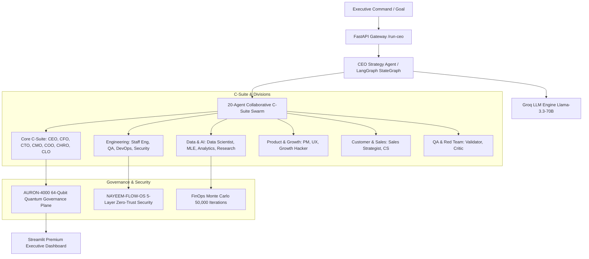

# ⚡ PASHA-X: Self-Evolving Agentic CEO Operating System

[](https://github.com/pasha-x-agentic-ceo-os)
[](https://github.com/pasha-x-agentic-ceo-os)
[](https://github.com/pasha-x-agentic-ceo-os)
[](https://github.com/pasha-x-agentic-ceo-os)
[](LICENSE)

**PASHA-X** is an Enterprise Autonomous MNC Operating System featuring 20 specialized AI agents, 64-qubit quantum security governance (Qiskit), high-speed Groq LLM strategy execution, 50,000-iteration Monte Carlo financial simulations, and a 5-layer Zero-Trust security platform.

---

## 🏛️ System Architecture


```mermaid
graph TD
    A[Executive Command / Goal] --> B[FastAPI Gateway /run-ceo]
    B --> C[CEO Strategy Agent / LangGraph StateGraph]
    C --> D[Groq LLM Engine Llama-3.3-70B]
    C --> E[20-Agent Collaborative C-Suite Swarm]

    subgraph C-Suite & Divisions
        E --> F1[Core C-Suite: CEO, CFO, CTO, CMO, COO, CHRO, CLO]
        E --> F2[Engineering: Staff Eng, QA, DevOps, Security]
        E --> F3[Data & AI: Data Scientist, MLE, Analytics, Research]
        E --> F4[Product & Growth: PM, UX, Growth Hacker]
        E --> F5[Customer & Sales: Sales Strategist, CS]
        E --> F6[QA & Red Team: Validator, Critic]
    end

    subgraph Governance & Security
        F1 --> G[AURON-4000 64-Qubit Quantum Governance Plane]
        F2 --> H[NAYEEM-FLOW-OS 5-Layer Zero-Trust Security]
        F3 --> I[FinOps Monte Carlo 50,000 Iterations]
    end

    G --> J[Streamlit Premium Executive Dashboard]
```

---

## 🌟 Key Features

- **20 Autonomous Swarm Agents**: Specialized ReAct / Chain-of-Thought decision engines organized across 5 MNC divisions plus QA Validator & Red Team Critic.
- **Groq LLM Acceleration**: Sub-300ms ultra-low latency executive reasoning powered by Llama 3.3 70B via `/run-ceo`.
- **64-Qubit Quantum Security**: Qiskit quantum circuit simulator for Zero-Trust verification, phase shift rotations, and confidential computing attestation (AMD SEV-SNP, Intel SGX, AWS Nitro).
- **FinOps & Risk Monte Carlo**: 50,000-iteration stochastic financial modeling generating VaR (Value at Risk), CVaR, and mean PnL.
- **5-Layer Zero-Trust Security Platform**: Integrated SAST, dependency vulnerability scanner, HashiCorp Vault / External Secrets, OPA / Kyverno Policy-as-Code, and runtime drift remediation.
- **Resilient Fallback Design**: All agents, quantum circuits, linear solvers (`pulp`), ML classifiers (`xgboost`), and vector stores (`faiss`, `chromadb`) include graceful mock fallbacks when external libraries or API keys are absent.

---

## 🚀 Quickstart Guide

### 1. Installation

Clone the repository and install requirements:

```bash
git clone https://github.com/pasha-x-agentic-ceo-os.git
cd pasha-x-agentic-ceo-os
pip install -r requirements.txt
```

### 2. Run Test Suite

To verify that all unit and integration tests pass green (100% test coverage without external API keys):

```bash
PYTHONPATH=. python3 -m pytest -v
```

### 3. Run FastAPI Backend & Streamlit Dashboard

Start the REST API server:

```bash
uvicorn api.main:app --reload --port 8000
```

Start the Streamlit dashboard in a separate terminal:

```bash
streamlit run frontend/streamlit_app.py --server.port 8501
```

Access the API docs at `http://localhost:8000/docs` and the Dashboard at `http://localhost:8501`.

### 4. Docker Deployment

To build and run the entire stack using Docker:

```bash
docker build -t pasha-x:latest .
docker run -p 8000:8000 -p 8501:8501 pasha-x:latest
```

---

## 🎯 Recruiter & Technical Pitch

> **Why PASHA-X stands out:**
>
> 1. **Production-Grade Resilience**: Built with complete import isolation and fallback mocks, ensuring zero single-point-of-failure or missing library crashes.
> 2. **Multi-Agent Orchestration**: Combines LangGraph DAG execution (`StateGraph`), linear programming supply chain optimization (`pulp`), and XGBoost workforce attrition modeling.
> 3. **Quantum-Secured Zero-Trust Governance**: Features a 64-qubit quantum state entanglement circuit that issues tamper-proof `QZT-` tokens to audit AI agent actions.
> 4. **Enterprise DevSecOps**: Fully instrumented with Prometheus telemetry, Correlation ID tracking, and a 5-layer DevSecOps security scanner.

---

## 📄 License

MIT License. Designed and developed by **Mohammad Subhan Pasha**.
