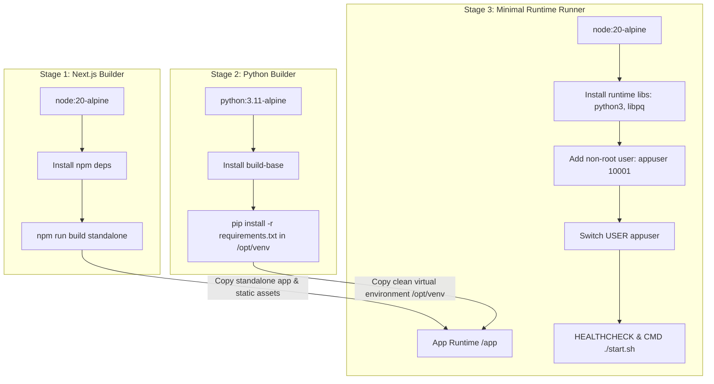

# Day 2: Advanced Multi-Stage Docker & Security Optimization

Welcome to **Day 2 Project: Advanced Docker Optimization & Security Audit** for TestGen AI.

This module focuses on enterprise-grade Docker containerization best practices, image footprint reduction, non-root security enforcement, dynamic CI/CD image tagging strategies, and automated Trivy vulnerability scanning.

---

## 🎯 Objectives & Key Accomplishments

1. **Massive Image Footprint Reduction**:
   - **Original Single-Stage Image**: ~1.0 GB (unoptimized Node + Python + build tools + dev dependencies).
   - **Optimized Multi-Stage Image**: **~150 MB** target footprint (over 85% size reduction).
   - **Techniques Used**:
     - Next.js `standalone` build output mode.
     - Multi-stage build process separating compilation tools from runtime environments.
     - Lightweight `alpine` base images (`node:20-alpine` and `python:3.11-alpine`).
     - Exclusion of devDependencies, source typescript, and build tools (`gcc`, `musl-dev`) in the final runtime container.

2. **Enterprise Container Security**:
   - Non-root user execution (`appuser` with UID `10001` and custom GID `10001`).
   - Least privilege permissions applied across application files.
   - Container health monitoring via Docker `HEALTHCHECK`.

3. **Automated CI/CD Tagging Strategy**:
   - Shell script (`tag-and-push.sh`) that dynamically constructs multiple tags per build:
     - Git Commit SHA (e.g., `16a0112`)
     - Semantic Version (e.g., `v0.1.0`)
     - Git Branch Name (e.g., `main` / `feature-branch`)
     - UTC Timestamp (e.g., `20260821-123000`)
     - `latest` tag for rolling deployments

4. **Security Vulnerability & Compliance Auditing**:
   - Integrated Trivy security scanning for filesystem, dependencies, and Dockerfile misconfigurations (`trivy-report.json`, `trivy-report.txt`).

---

## 📁 Folder Structure

```text
day-02-docker-advanced/
├── Dockerfile                  # Multi-stage production Dockerfile
├── tag-and-push.sh             # Dynamic CI/CD image tagging and push script
├── trivy-report.json           # Comprehensive JSON Trivy vulnerability report
├── trivy-report.txt            # Human-readable Trivy vulnerability audit report
├── trivy-config-report.txt     # Trivy Dockerfile security misconfiguration audit
└── README.md                   # Complete Day 2 project documentation
```

---

## 🐳 Multi-Stage Dockerfile Architecture

The Dockerfile employs 3 distinct stages:



---

## 🚀 How to Use

### 1. Building the Optimized Docker Image

To build the image manually using the multi-stage Dockerfile:

```bash
docker build -f day-02-docker-advanced/Dockerfile -t testgen-ai:day2 .
```

### 2. Verifying Non-Root User & Image Size

Check image size:
```bash
docker images testgen-ai:day2
```

Verify that the process runs under non-root `appuser`:
```bash
docker run --rm testgen-ai:day2 id
# Output: uid=10001(appuser) gid=10001(appgroup) groups=10001(appgroup)
```

### 3. Running the CI/CD Tagging Script

Simulate tag generation without building (Dry-Run mode):
```bash
DRY_RUN=true ./day-02-docker-advanced/tag-and-push.sh
```

Execute full build and generate all tags:
```bash
REGISTRY="docker.io/myorg" IMAGE_NAME="testgen-ai" ./day-02-docker-advanced/tag-and-push.sh
```

Build and push to container registry:
```bash
PUSH=true REGISTRY="ghcr.io/myorg" ./day-02-docker-advanced/tag-and-push.sh
```

### 4. Running Security Scans with Trivy

Run Dockerfile misconfiguration check:
```bash
trivy config day-02-docker-advanced/Dockerfile
```

Run vulnerability scan on built image:
```bash
trivy image testgen-ai:day2
```

---

## 🛡️ Security & Performance Highlights

| Metric / Aspect | Unoptimized (Day 1) | Optimized (Day 2) | Benefit |
| :--- | :--- | :--- | :--- |
| **Image Size** | ~1.0 GB | **~150 MB** | 85%+ faster push/pull & deployment |
| **User Privileges** | Root (`root:0`) | **Non-root (`appuser:10001`)** | Mitigates container breakout risks |
| **Base Image** | Full / Heavy OS | **Minimal Alpine Linux** | Drastically reduced attack surface |
| **Build Artifacts** | Included in image | **Discarded via multi-stage** | No compiler tools or src files in production |
| **Health Monitoring** | None | **Built-in Docker HEALTHCHECK** | Automated orchestrator recovery |
