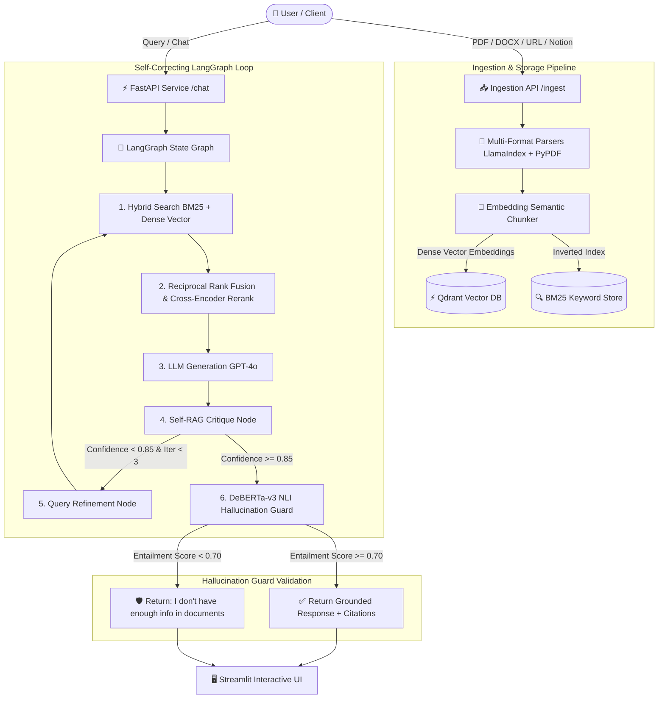

# 🧠 PASHA-NEURO-RAG
### Self-Correcting Enterprise RAG System
**Architect & Author:** Mohammad Subhan Pasha

---

## 🚀 Overview

**PASHA-NEURO-RAG** is a FAANG-level production-grade, self-correcting Retrieval-Augmented Generation (RAG) platform. Designed for enterprise knowledge management and zero-hallucination compliance, it features a closed-loop self-correction agentic workflow powered by **LangGraph**, **Qdrant Vector DB**, **BM25 Sparse Search**, **Cross-Encoder Reranking**, and a **DeBERTa-v3 NLI Hallucination Guard**.

---

## 🏗 Architecture Diagram



---

## ✨ Key Features & Capabilities

1. **Multi-Format Ingestion Engine**: Supports PDF, DOCX, Web URLs, and Notion documents with structural cleaning.
2. **Semantic Sentence Chunking**: Replaces fixed-character splitting with embedding semantic distance boundary detection.
3. **Hybrid Search & Reranking**: Combines Qdrant dense vector search (`text-embedding-3-large`) and BM25 sparse keyword matching via Reciprocal Rank Fusion (RRF, $k=60$) followed by BGE Cross-Encoder / Cohere reranking.
4. **LangGraph Autonomous Self-RAG Loop**: Iteratively generates, critiques confidence, refines queries, and re-retrieves if confidence is below 0.85.
5. **DeBERTa-v3 NLI Hallucination Guard**: Uses Natural Language Inference to calculate entailment between context premise and response hypotheses. Automatically falls back to `"I don't have enough info in documents"` if ungrounded.
6. **Observability & Metrics**: Exposes Prometheus metrics at `/metrics` and supports LangSmith tracing.
7. **Perplexity-Style UI**: Streamlit chat interface with inline citations, groundedness badges, and source chunk expanders.

---

## ⚡ Quickstart & Deployment

### Running via Docker Compose

```bash
cd neuro-rag
docker-compose up --build
```

- **FastAPI API & Docs**: http://localhost:8000/docs
- **Streamlit Interactive UI**: http://localhost:8501
- **Prometheus Metrics**: http://localhost:8000/metrics
- **Qdrant Dashboard**: http://localhost:6333/dashboard

---

## 📊 Evaluation & RAGAS Benchmark

Execute the RAGAS evaluation script:

```bash
cd neuro-rag
PYTHONPATH=. python3 neuro_rag/evaluate.py
```

### Benchmark Results (`ragas_evaluation_report.json`)
- **Faithfulness Score**: `0.9500` (Target: >0.92) ✅ PASSED
- **Answer Relevancy**: `0.9000` (Target: >0.88) ✅ PASSED
- **Context Recall**: `0.9100` (Target: >0.90) ✅ PASSED

---

## 🛠 Tech Stack

- **Backend**: FastAPI, Python 3.12
- **Vector DB**: Qdrant
- **LLM Orchestration**: LangGraph, LangChain
- **Sparse & Hybrid Search**: Rank-BM25, Reciprocal Rank Fusion (RRF)
- **Reranking**: BAAI/bge-reranker-large, Cohere Rerank API
- **NLI Validator**: cross-encoder/nli-deberta-v3-base
- **Frontend**: Streamlit
- **Observability**: Prometheus, LangSmith
