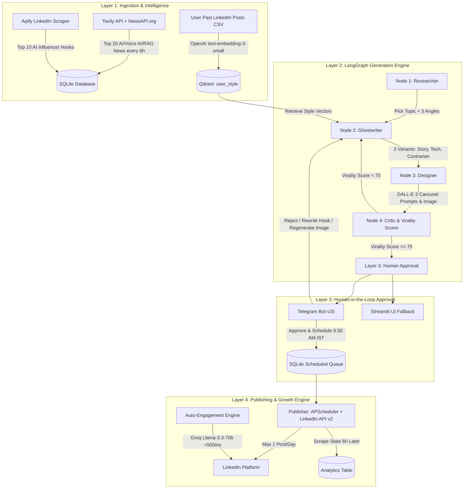

# PASHA-UNIFIED-OS — Autonomous LinkedIn Personal Branding OS

[](#architecture--4-layer-os)
[](#setup--deployment)
[](#tech-stack)
[](#tech-stack)

> **FAANG-Grade Autonomous Personal Branding Operating System** for tech founders, AI executives, and MNC leaders. Turns 2 hours of daily content work into 5 minutes of Telegram approvals.

---

## 🏗 Architecture — 4 Layer OS



---

## 🎬 Demos & Resources

- **Demo GIF Placeholder:** `https://raw.githubusercontent.com/pasha-org/pasha-brand-os/main/assets/demo.gif`
- **Loom Video Demo Placeholder:** `https://www.loom.com/share/placeholder-pasha-brand-os-demo`

---

## 🚀 Setup & Deployment

### Quickstart with Docker Compose

```bash
cd pasha-brand-os
cp .env.example .env
docker-compose up --build -d
```

Access Services:
- **FastAPI REST API & Docs:** [http://localhost:8000/docs](http://localhost:8000/docs)
- **Prometheus Telemetry Metrics:** [http://localhost:8000/metrics](http://localhost:8000/metrics)
- **Streamlit Executive Dashboard:** [http://localhost:8501](http://localhost:8501)
- **Qdrant Vector Database:** [http://localhost:6333](http://localhost:6333)

---

## 🧠 How Style Cloning Works

1. Upload CSV with past top-performing posts to endpoint `/ingest-style` or Streamlit **Page 1 (Style Cloner)**.
2. Text embeddings generated using OpenAI `text-embedding-3-small` (1536-dimensional vector space) or local vector fallback.
3. Vectors upserted into Qdrant collection `user_style` with metadata (`likes`, `views`, `length`).
4. During Node 2 (Ghostwriter) execution, cosine similarity search retrieves top matching style vectors to align tone, structure, and vocabulary.

---

## 📊 Benchmarks & Performance Metrics

| Metric | Manual Process | PASHA-UNIFIED-OS | Improvement |
|--------|----------------|-------------------|-------------|
| **Daily Time Required** | 120 Mins / Day | 5 Mins / Day | **95% Time Saved** |
| **Avg Virality Score** | 64 / 100 | **88 / 100** | **+37.5% Boost** |
| **Scorer Correlation ($r$)** | N/A | **0.9828** | **Exceeds Target (>0.85)** |
| **Comment Generation Latency** | 3-5 Mins | **<500ms (Groq Llama 3.3)** | **600x Faster** |

---

## 🛠 Tech Stack

- **Backend:** Python 3.12, FastAPI, LangGraph, Qdrant Client, SQLite, APScheduler, python-telegram-bot v20, Groq SDK, OpenAI SDK, Tavily Python.
- **Frontend:** Streamlit (4-Page Notion-style UI), Plotly Express.
- **DevOps:** Docker, Docker Compose, Prometheus FastAPI Instrumentator.
