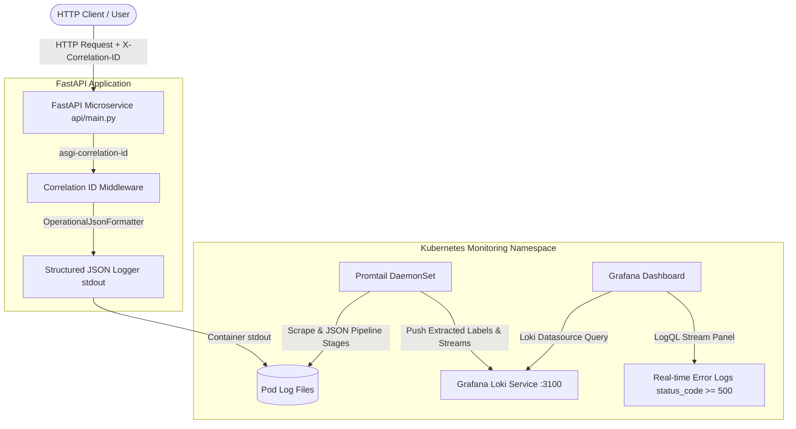

# PASHA-OS Centralized Observability & Distributed Logging (PLG Stack)

Enterprise-grade centralized logging and distributed correlation ID telemetry pipeline for containerized FastAPI microservices on Kubernetes using Promtail, Grafana Loki, and Grafana (PLG Stack).

---

## 🏗️ Architecture Diagram



---

## 📁 Repository Structure

- `api/main.py`: FastAPI server with `asgi-correlation-id` middleware (`X-Correlation-ID`) and non-blocking `python-json-logger` structured JSON stream to `stdout`.
- `monitoring/promtail-config.yaml`: Promtail custom pipeline stages parsing JSON logs and extracting labels (`level`, `http_method`, `status_code`).
- `monitoring/datasources/loki-datasource.yaml`: Provisioning configuration for Loki datasource (`http://loki.monitoring.svc.cluster.local:3100`).
- `monitoring/dashboards/finagent-dashboard.json`: Grafana dashboard featuring embedded LogQL log streaming panel (`status_code >= 500`).
- `scripts/deploy-logging.sh`: Idempotent Helm deployment script for Loki & Promtail stack.
- `tests/test_pasha_os.py`: Comprehensive pytest test suite validating structured log schema and correlation ID header propagation.
- `requirements.txt`: Python dependency manifest including `python-json-logger` and `asgi-correlation-id`.

---

## ⚡ Quickstart & Deployment

### 1. Deploy PLG Stack on Kubernetes
```bash
./scripts/deploy-logging.sh
```

### 2. Verify Pod Status
```bash
kubectl get pods -n monitoring -l app=loki
kubectl get pods -n monitoring -l app=promtail
```

---

## 🧪 Verification & Operational Commands

### 1. Run Test Suite
```bash
python3 -m pytest tests/ -v
```

### 2. Linting Check
```bash
flake8 api tests --max-line-length=120
```

### 3. Verify Response Header & Log Stream
```bash
curl -i -H "X-Correlation-ID: test-correlation-id-12345" http://localhost:8000/health
```

### 4. LogQL Query Snippets (Grafana Explore / Dashboard)
- **Error Log Stream:**
  ```logql
  {job="kubernetes-pods"} | json | status_code >= 500 or level="ERROR"
  ```
- **Filter by Specific Correlation ID:**
  ```logql
  {job="kubernetes-pods"} | json | correlation_id="test-correlation-id-12345"
  ```
- **Latency Spikes (> 500ms):**
  ```logql
  {job="kubernetes-pods"} | json | latency_ms > 500
  ```

---

## 📸 Dashboards & Verification Screenshots

*(Place screenshots here: Grafana Explore LogQL Query, Grafana Log Streaming Panel, and Terminal output of curl with X-Correlation-ID)*
