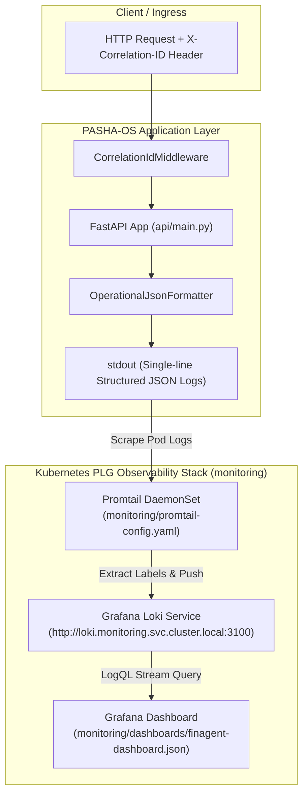

# PASHA-OS Centralized Observability & PLG Logging Telemetry

Enterprise Centralized Observability Pipeline and PLG (Promtail + Loki + Grafana) Stack for **PASHA-OS**.

---

## 🏗️ Observability Architecture Diagram



---

## 📊 Telemetry & Log Schema

All application logs are formatted as single-line JSON objects and streamed directly to `stdout`:

```json
{
  "timestamp": "2026-08-27T09:49:18.123456+00:00",
  "level": "INFO",
  "logger_name": "pasha_os",
  "correlation_id": "c1a2b3c4-d5e6-7f8a-9b0c-1d2e3f4a5b6c",
  "http_method": "GET",
  "path": "/health",
  "status_code": 200,
  "client_ip": "127.0.0.1",
  "latency_ms": 1.45,
  "message": "HTTP GET /health - 200 (1.45ms)"
}
```

### Key Components Replicated
- **`api/main.py`**: Configured with `asgi-correlation-id` (`CorrelationIdMiddleware`), injecting `X-Correlation-ID` header into every request/response cycle, and `OperationalJsonFormatter` for structured stdout logging.
- **`monitoring/promtail-config.yaml`**: ConfigMap defining Promtail pipeline stages for JSON parsing and indexing labels (`level`, `http_method`, `status_code`).
- **`monitoring/datasources/loki-datasource.yaml`**: Provisioning ConfigMap for Loki datasource pointing to `http://loki.monitoring.svc.cluster.local:3100`.
- **`monitoring/dashboards/finagent-dashboard.json`**: Executive Grafana dashboard featuring real-time LogQL error stream panel (`status_code >= 500`).
- **`scripts/deploy-logging.sh`**: Idempotent Bash script executing Helm installation for Loki & Promtail in the `monitoring` namespace.
- **`tests/test_pasha_os.py`**: Test suite with 26 unit tests validating API routes, correlation ID propagation, and JSON logging format.
- **`requirements.txt`**: Python dependencies including `python-json-logger==4.2.0` and `asgi-correlation-id==5.0.1`.

---

## 🧪 Verification & Testing Steps

### 1. Execute Unit & Integration Tests
Run pytest across the test suite to verify response headers and JSON telemetry formatting:
```bash
pytest tests/ -v
```

### 2. Code Linting & Quality Verification
Ensure code style adheres to PEP8 guidelines:
```bash
flake8 agents core api tests dashboard --max-line-length=120
```

### 3. Validate Correlation ID Propagation
Start the FastAPI server and send a request with a custom correlation ID header:
```bash
# Start server
uvicorn api.main:app --port 8000 &

# Send HTTP GET with X-Correlation-ID
curl -i -H "X-Correlation-ID: test-correlation-id-99999" http://localhost:8000/health
```
Verify that `X-Correlation-ID: test-correlation-id-99999` is returned in the HTTP response header.

### 4. Verify Kubernetes Logging Stack Logs
Check the status and log output of Promtail and Loki pods:
```bash
kubectl get pods -n monitoring -l app=loki
kubectl get pods -n monitoring -l app=promtail
kubectl logs -n monitoring -l app.kubernetes.io/name=promtail --tail=50
```

---

## 🚀 Operational Runbook & LogQL Queries

### Deploy PLG Logging Stack
Deploy Loki and Promtail using the automated Helm script:
```bash
./scripts/deploy-logging.sh
```

### LogQL Useful Queries
- **Error Stream Panel Query (HTTP 5xx & Errors):**
  ```logql
  {app="pasha-os"} | json | status_code >= 500 or level="ERROR"
  ```
- **Filter by Specific Correlation ID:**
  ```logql
  {job="kubernetes-pods"} | json | correlation_id="YOUR-CORRELATION-ID"
  ```
- **Filter High-Latency Requests (> 500ms):**
  ```logql
  {job="kubernetes-pods"} | json | latency_ms > 500
  ```

---

## 📸 Screenshots & Dashboards


*Figure 1: Real-Time Grafana LogQL Error Streaming Panel for PASHA-OS*


*Figure 2: End-to-End Correlation ID Propagation Trace View*
